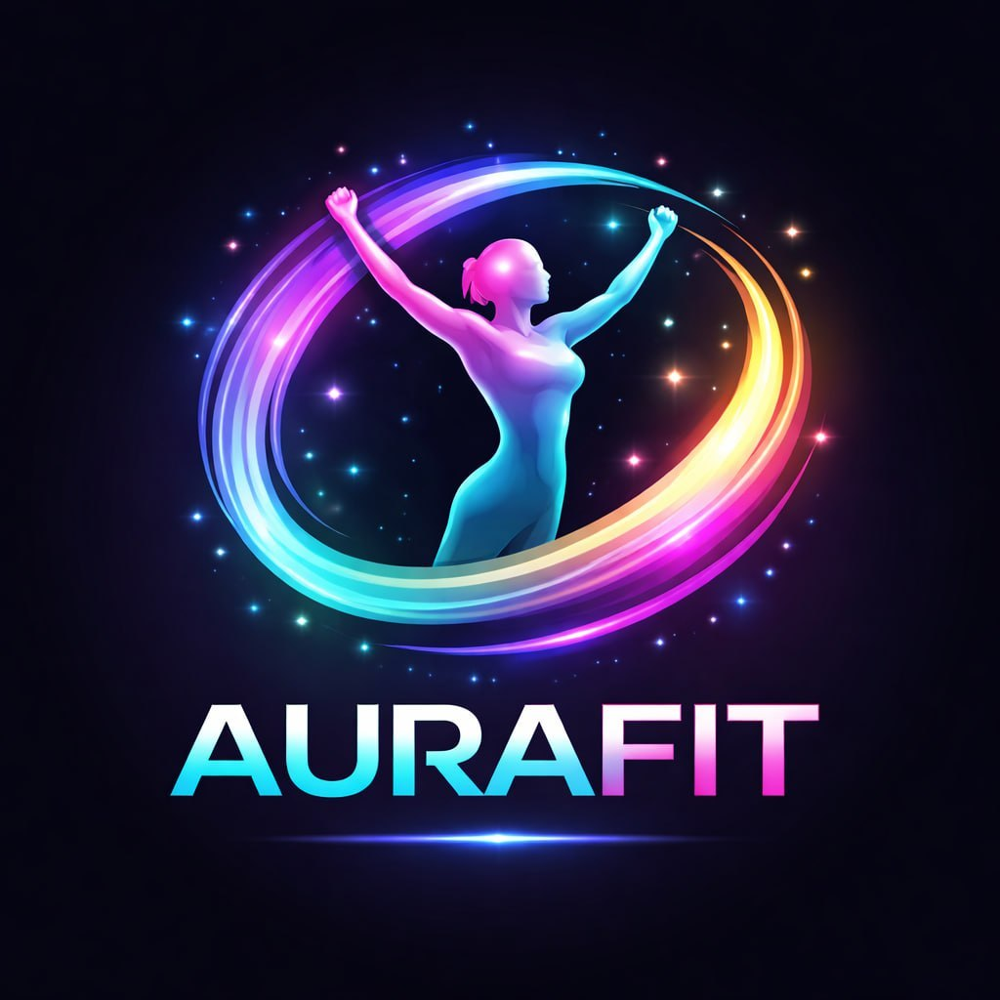
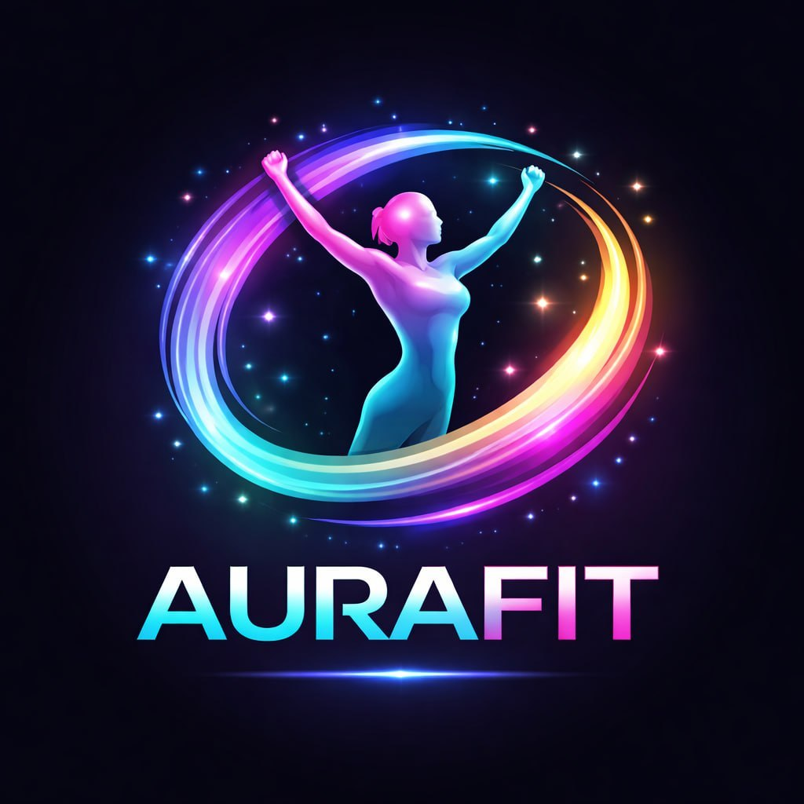

# AuraFit AI

<p align="center">
  
</p>

<p align="center">
  AI-powered fitness companion for personalized workout guidance and nutrition analysis.
</p>

AuraFit AI is a Flutter application that helps users build healthier habits through AI-generated plans, daily schedules, and image-based food/body analysis.

## Tech Stack

- Dart
- Flutter (Material 3)
- Firebase Core
- Firebase Authentication
- Cloud Firestore
- Shared Preferences
- Image Picker
- HTTP
- flutter_dotenv

## What The App Does (Technical)

- Authenticates users with Firebase Auth and persists profile state in Firestore.
- Stores setup and lightweight profile data locally via SharedPreferences.
- Uses camera/gallery image input and sends bytes to an AI analysis service.
- Generates AI-based workout plans and schedule text from user metrics.
- Supports dark/light theme toggle with persistent theme mode.
- Ships Flutter Web build from `docs/` for static hosting.

## UI Preview

Use these previews so developers can quickly understand the product flow.

<p align="center">
  
  
</p>

## Run Locally

1. Install Flutter SDK (stable) and confirm with:
   ```bash
   flutter --version
   ```
2. Clone this repository and enter the project:
   ```bash
   git clone <your-repo-url>
   cd aurafit
   ```
3. Install Dart/Flutter dependencies:
   ```bash
   flutter pub get
   ```
4. Configure environment variables in `.env` (root):
   ```env
   GROQ_API_KEY=your_key_here
   ```
5. Ensure Firebase config is present:
- `lib/firebase_options.dart`
- `android/app/google-services.json`
6. Run on a device/emulator:
   ```bash
   flutter run
   ```
7. (Optional) Run web build:
   ```bash
   flutter run -d chrome
   ```

## Landing Page

A user-facing landing page is included at:

- `docs/landing.html`

Open locally in a browser, or deploy with GitHub Pages/Firebase Hosting.

## License

This project is licensed under the MIT License. See [LICENSE](LICENSE).
